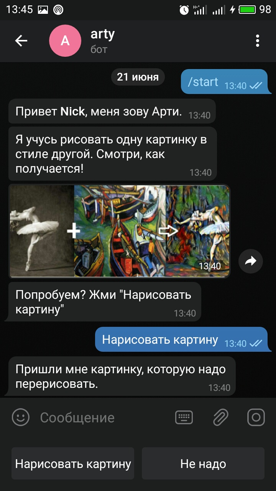
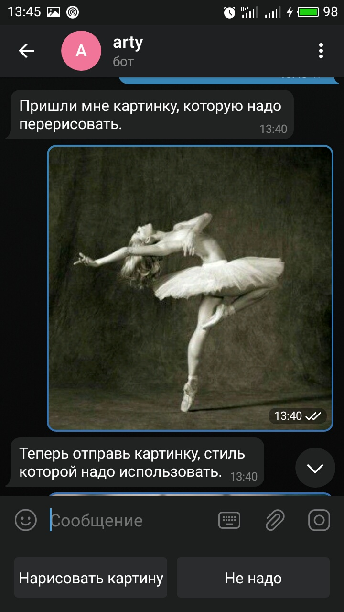
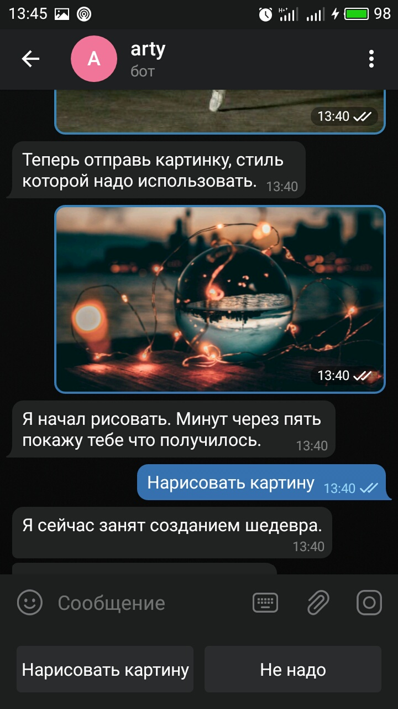
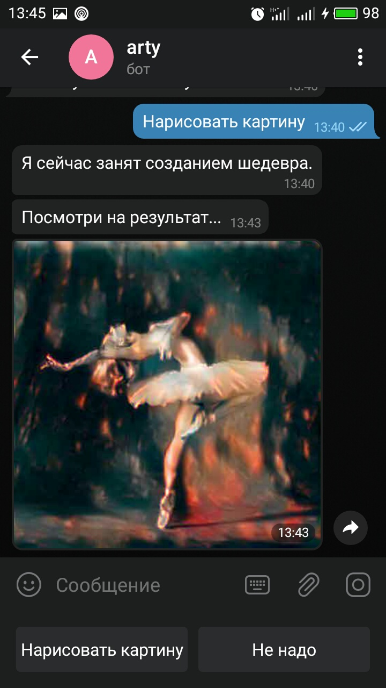

# Telegram бот на языке Python 3 реализующий style transfer neural net.

Данный телеграм бот реализует работу style transfer neural net. Суть данного подхода заключается в том, что некая картинка преобразуется в новую с другим стилем, который был задан.

Бот предлагает пользователю прислать ему картинку с контентом, которую надо преобразовать и картинку, стиль которй будет использован. Через некоторое время (порядка 3 минут) обратно пользователю присылается измененное первоначальное изображение. 

Телеграм бот [*@artydltestbot*](https://t.me/artydltestbot) доступен в [telegram](https://telegram.org/) и развернут на сервере [Heroku](https://www.heroku.com/). Бот построен на библиотеке [pyTelegramBotAPI](https://github.com/eternnoir/pyTelegramBotAPI). Работает в синхронном режиме. Выполняет дейстиве на запрос одного пользователя. Другие запросы в это время игнорируются с уведомлением о занятости. Для асинхронности можно использовать библиотеку [AIOgram](https://docs.aiogram.dev/en/latest/).

Бесплатный аккаунт Heroku имеет отграничени в 500 мб и отсутсвие GPU. 

За основу взята предобученаая VGG19. Для работы бота, перед деплоем на сервер, часть фитчей сети предварительно сохранятся в файл *trim_vgg.pth* (файл уже есть в каталоге) путем запуска скрипта *make_net.py*.

Конечная модель содержит небольшое количество слоев для работы на Heroku. Структура style transfer сети:
```
  (0):              Normalize(mean=(0.485, 0.456, 0.406), std=(0.229, 0.224, 0.225))
  (conv_1):         Conv2d(3, 64, kernel_size=(3, 3), stride=(1, 1), padding=(1, 1))
  (style_loss_1):   StyleLoss()
  (relu_1):         ReLU()
  (conv_2):         Conv2d(64, 64, kernel_size=(3, 3), stride=(1, 1), padding=(1, 1))
  (style_loss_2):   StyleLoss()
  (relu_2):         ReLU()
  (pool_2):         MaxPool2d(kernel_size=2, stride=2, padding=0, dilation=1, ceil_mode=False)
  (conv_3):         Conv2d(64, 128, kernel_size=(3, 3), stride=(1, 1), padding=(1, 1))
  (content_loss_3): ContentLoss()
  (style_loss_3):   StyleLoss()
```

## Скриншоты






